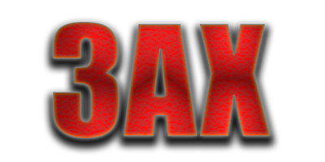

[English](/README.md) | [Русский](/README.ru_RU.md)

<p align="center">
  <picture>
    <source media="(prefers-color-scheme: dark)" srcset="./media/3ax-ui-dark.png">
    
  </picture>
</p>

[](https://github.com/coinman-dev/3ax-ui/releases)
[](https://github.com/coinman-dev/3ax-ui/actions)
[](#)
[](https://github.com/coinman-dev/3ax-ui/releases/latest)
[](https://www.gnu.org/licenses/gpl-3.0.en.html)

**3AX-UI** — форк панели управления [3x-ui](https://github.com/MHSanaei/3x-ui), расширенный встроенной поддержкой протокола **AmneziaWG**.

> **A** в названии означает **Amnezia** — протокол, который является основным отличием этой панели от оригинала.

> [!IMPORTANT]
> Проект предназначен для личного использования. Пожалуйста, не используйте его в незаконных целях.

## Быстрый старт

```bash
bash <(curl -Ls https://raw.githubusercontent.com/coinman-dev/3ax-ui/master/install.sh)
```

Для установки последней pre-release версии:

```bash
bash <(curl -Ls https://raw.githubusercontent.com/coinman-dev/3ax-ui/master/install.sh) --beta
```

---

## Зачем эта панель?

Оригинальная 3x-ui построена вокруг ядра **Xray** и поддерживает протоколы VLESS, VMess, Trojan, Shadowsocks и WireGuard. Однако **AmneziaWG** — модифицированный WireGuard с обфускацией трафика — в оригинале не поддерживается.

**3AX-UI** решает эту задачу: AmneziaWG интегрирован напрямую в панель и управляется точно так же, как любой другой протокол — через привычный интерфейс подключений.

---

## Главные отличия от оригинальной 3x-ui

### 1. Полная поддержка AmneziaWG

AmneziaWG — это WireGuard с добавленной обфускацией пакетов. Обычный WireGuard легко детектируется и блокируется DPI-системами (Россия, Иран, Китай). AmneziaWG делает трафик неотличимым от случайного шума.

**Что добавлено:**
- Отдельная страница настроек AWG-сервера (сетевые параметры, пул адресов IPv4/IPv6, параметры обфускации)
- Управление клиентами AWG прямо со страницы **Подключения** — так же, как VLESS или Trojan
- Для каждого клиента: автоматическая генерация ключей (приватный, публичный, preshared), выделение IP из пула, QR-код, скачивание `.conf` файла
- Сбор статистики трафика каждые 10 секунд (upload/download на клиента)
- Лимиты трафика и дата окончания — всё то же, что и у других протоколов

### 2. Параметры обфускации AmneziaWG

На странице настроек AWG можно настроить параметры обфускации пакетов:

| Параметр | Описание |
|----------|----------|
| `Jc` | Количество junk-пакетов перед handshake |
| `Jmin` / `Jmax` | Минимальный и максимальный размер junk-пакетов |
| `S1` / `S2` | Размер заголовков init/response |
| `H1` – `H4` | Magic headers для разных типов пакетов |

Эти параметры автоматически прописываются в конфиг каждого клиента — пользователю ничего настраивать не нужно.

### 3. Поддержка IPv6 без NAT

Клиентам AWG может выдаваться **нативный публичный IPv6-адрес** сервера — без NAT66. Это работает через NDP proxy (ndppd или встроенный fallback через `ip -6 neigh add proxy`). Клиент получает реальный IPv6, что важно для сервисов, требующих его поддержки.

#### Если IPv6 не работает: ограничения на стороне провайдера

NDP proxy может не работать на VPS по причинам, не зависящим от настроек сервера:

**1. Гипервизор блокирует NDP-пакеты (MAC-фильтрация)**

Многие провайдеры на уровне гипервизора разрешают VPS отправлять пакеты только с MAC-адреса её сетевого интерфейса. Когда `ndppd` пересылает Neighbor Advertisement от имени клиента, гипервизор воспринимает это как IP-спуфинг и дропает пакет. Внутри VPS всё выглядит корректно, но IPv6-трафик клиентов до интернета не доходит.

**2. Провайдер выдаёт «link prefix», а не «routed prefix»**

NDP proxy работает только тогда, когда блок IPv6-адресов **маршрутизируется непосредственно на ваш VPS**. Многие провайдеры подключают несколько VPS к одной виртуальной сети и выдают адреса из общего пула — в таком случае NDP proxy на уровне VPS не поможет.

#### Что делать

Обратитесь в поддержку провайдера. Нужно выяснить:
- **Тип выделения IPv6:** маршрутизируемый /64-префикс (routed prefix) или адрес из общего пула (link prefix). Только routed prefix позволяет использовать NDP proxy.
- **NDP proxy на гипервизоре:** есть ли опция включения NDP proxy / Neighbor Discovery на уровне хоста.
- **Разрешение IP-спуфинга:** попросите разрешить пересылку NDP-пакетов с вашего VPS.

> **Формулировка для поддержки (на английском):**
> *"I'm running a server with multiple virtual network interfaces and need to assign individual public IPv6 addresses from my /64 block to each of them using NDP proxy. Could you please confirm whether my IPv6 allocation is a fully routed /64 prefix routed to my VM directly, and whether NDP Neighbor Advertisement packets originated from my VM are allowed through the hypervisor — or if they are dropped by MAC/ARP filtering on the host node?"*

### 4. Автоматическая установка AmneziaWG

Скрипт установки (`install.sh`) автоматически:
- Устанавливает ядро AmneziaWG через PPA `ppa:amnezia/ppa`
- Устанавливает `awg-tools` и `ndppd`
- Определяет внешний интерфейс сервера и настраивает PostUp/PostDown правила
- Настраивает автозапуск AWG после перезагрузки сервера
- Обнаруживает Secure Boot и предупреждает о возможных проблемах с DKMS-модулем

### 5. Настраиваемый размер QR-кодов

В настройках панели добавлена опция **Размер QR-кода**:
- 300×300 px — компактный
- 450×450 px — стандартный (по умолчанию)
- 600×600 px — крупный

### 6. Безопасный URL подписки по умолчанию

При установке панели URL-путь подписки автоматически генерируется со случайным 12-символьным суффиксом (например `/sub-Xk92mPqLvzRt/`) вместо стандартного `/sub/`. Это снижает риск случайного обнаружения.

---

## Требования к серверу

- **ОС:** Ubuntu 22.04+ / Debian 11+
- **Ядро Linux:** 5.6+ (для встроенного WireGuard), или установленный DKMS-модуль AmneziaWG
- **RAM:** от 1024 МБ
- **Архитектура:** amd64 / arm64

> **Secure Boot:** Если на сервере включён Secure Boot, DKMS-модуль AmneziaWG может не загрузиться. Скрипт установки предупредит об этом автоматически.

---

## Установка

```bash
# Стабильная версия
bash <(curl -Ls https://raw.githubusercontent.com/coinman-dev/3ax-ui/master/install.sh)

# Последняя pre-release версия
bash <(curl -Ls https://raw.githubusercontent.com/coinman-dev/3ax-ui/master/install.sh) --beta

# Конкретная версия
bash <(curl -Ls https://raw.githubusercontent.com/coinman-dev/3ax-ui/master/install.sh) v1.0.0
```

---

## Быстрый старт с AmneziaWG

1. Войдите в панель → **Настройки AWG**
2. Настройте сетевые параметры и параметры обфускации
3. Перейдите на страницу **Подключения** → **Создать подключение**
4. Выберите протокол **amneziawg** — введите Email клиента и нажмите **Создать**
5. В таблице клиентов нажмите на иконку QR-кода — отсканируйте в приложении AmneziaVPN

---

## Совместимые клиенты AmneziaWG

| Клиент | Платформа | Ссылка |
|--------|-----------|--------|
| AmneziaVPN | Android, iOS, Windows, macOS, Linux | [amnezia.org](https://amnezia.org) |

> Стандартные WireGuard-клиенты **не совместимы** с AmneziaWG — они не поддерживают параметры обфускации.

---

## Основа

3AX-UI основан на **[3x-ui](https://github.com/MHSanaei/3x-ui)** за авторством [MHSanaei](https://github.com/MHSanaei). Все оригинальные возможности (VLESS, VMess, Trojan, Shadowsocks, WireGuard, Xray, подписки, Telegram-бот и т.д.) полностью сохранены.

## Благодарности

- [MHSanaei](https://github.com/MHSanaei/) — автор оригинальной 3x-ui
- [alireza0](https://github.com/alireza0/) — автор оригинальной x-ui
- [Iran v2ray rules](https://github.com/chocolate4u/Iran-v2ray-rules) (GPL-3.0)
- [Russia v2ray rules](https://github.com/runetfreedom/russia-v2ray-rules-dat) (GPL-3.0)

---

## Лицензия

Проект распространяется под той же лицензией, что и оригинальная 3x-ui — [GNU GPL v3](LICENSE).
